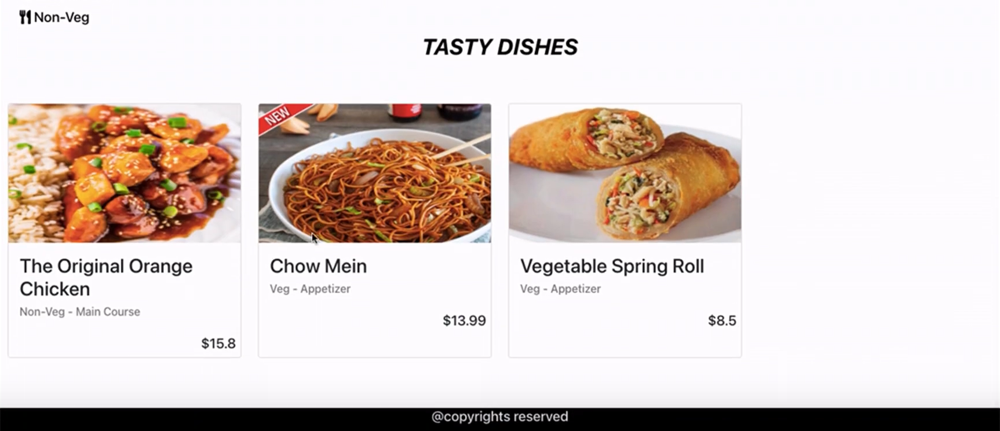
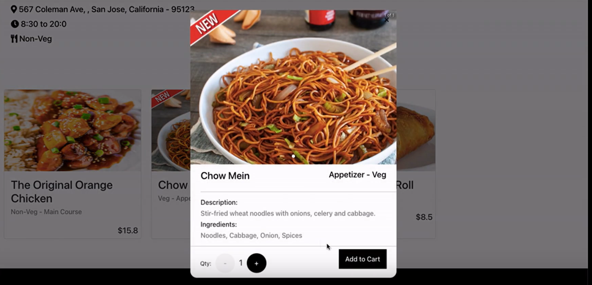
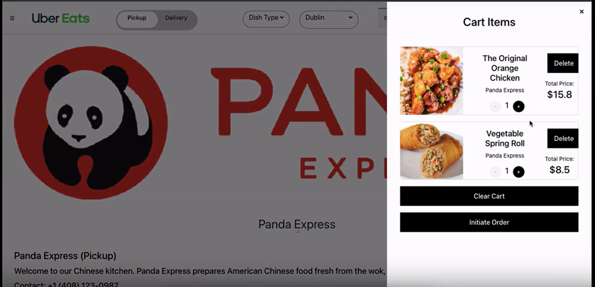
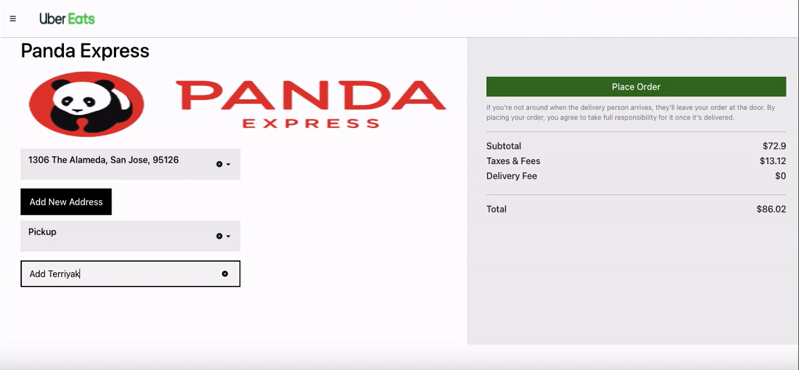

# UberEats

## [YouTube Link](https://www.youtube.com/watch?v=vONplcQzHvc&ab_channel=AkashRupapara)

This is Food delivery platform with functinality of creating order from restaurant for different food items. Customer can search for restaurant with dish name, location, dish type and Delivery Type (Pickup or delivery). Two personas were implemented (Customer and Restaurant Owner).
This application is developed using MERN Stack with integration of Kafka(Message Queues) and GraphQL to get improved performance.

Glimpses of Application:

